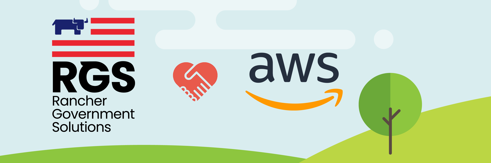
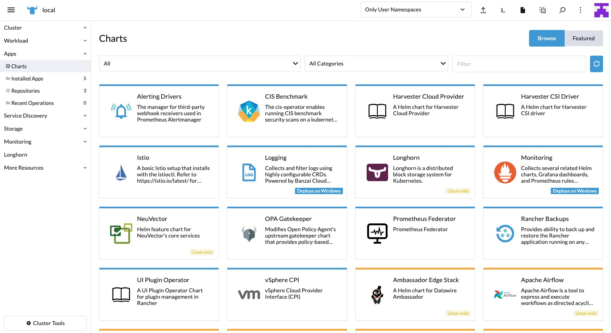

# No-Code Deployment of Rancher Kubernetes on AWS GovCloud

### Table of Contents

* [Introduction](#introduction)
* [Challenges with Kubernetes](#challenges-with-kubernetes)
* [Why Rancher on AWS](#why-rancher-on-aws)
* [No-Code Deployment](#no-code-deployment)
* [Cloud Native Options](#Cloud-Native-Options)
* [What's Next](#what's_next)

## Introduction

Over the last few years, Kubernetes has revolutionized the world of infrastructure and application distribution. From bare-metal servers to virtual machines to containers, Kubernetes has caused teams to re-evaluate their entire technology stack, in the best way possible. However, for many teams Kubernetes remains a very tall mountain to cross. Let's take a look at the infrastructure side of things.

## Challenges with Kubernetes

Most teams start off in the world of clusters and containers and quickly realize the complexity of the configuration, management, and deployment. From service meshes to ingress controllers to deployments to registries and more, Kubernetes is not as simple as it seems. OpsRamp has a great [chapter](https://www.opsramp.com/guides/why-kubernetes/challenges-with-kubernetes/) about all the challenges. Teams start to get overwhelmed with all the decisions points. There are almost TOO many options out there. Teams start exploring open-source tools, enterprise tools, or start diving down the deep dark path of internal development. Does your team want to take on the tech debt of managing locally? For our teams, we have always wanted to have balance between the workload, the features, and of course, the total cost. Thankfully there are many managed Kubernetes or Kubernetes-As-A-Service offerings. As an industry, we keep seeing the numbers shift away from self-managed Kubernetes to managed Kubernetes. Here's where we can start to talk about how much easier the implementation and management of Kubernetes can be.

But there are trade offs. One thing to think about is the skill set needed to deploy an identical Kubernetes cluster at the edge, or even air gapped. Having a flexible deployment module is valuable for these types of scenarios. Another thing to consider is development or demo clusters. Being able to rapidly prototype an on-premise cluster in the cloud can greatly improve velocity for all the teams involved. Another thing to think about is vendor lock-in. Some of the cloud providers charge to get your data out. So how can we have the best of both worlds? Deploy a Kubernetes distribution, that you can take anywhere, to a cloud environment.

## Why Rancher on AWS

Rancher is rapidly becoming the Kubernetes of choice for every agency and company. The Rancher stack has some very good choices for all the different layers of infrastructure. Rancher, as a stack, is completely malleable. Meaning you can pick and choose which piece you want to run when and where. This gives greater flexibility to engineering the right infrastructure at the right time for the right location. The Rancher stack can be deployed anywhere. We have deployments from every cloud provider down to the tactical edge. In addition the Rancher stack is open-source. This is important for better transparency for security and code quality. Sound good, how about a "No-Code" deployment of the stack? Rancher Government Solutions ([RGS](https://ranchergovernment.com/)) worked with [AWS](https://aws.amazon.com/) to develop a marketplace offering to dramatically reduce the barrier to entry. The offering is a fully-HA free trial of RKE2 and Rancher Manager by Rancher Government Solutions([RGS](https://ranchergovernment.com/)), designed for US Federal Customers.

## No-Code Deployment

Seriously. It's zero code, zero configuration, and zero hassle. But what do we get?

* [AWS](https://aws.amazon.com/)'s Virtual Private Cloud ([VPC](https://aws.amazon.com/vpc/)), Elastic Compute ([EC2](https://aws.amazon.com/ecs/)), Elastic Load Balancer ([ELB](https://aws.amazon.com/elasticloadbalancing/)), Route 53([DNS](https://aws.amazon.com/route53/))
* Rancher's Kubernetes Distribution [RKE2](https://www.rancher.com/products/rke) which is designed for the Federal Government's high security standards.
* Rancher's Multi-Cluster Manager, also known as [Rancher or MCM](https://www.rancher.com/products/rancher)
* In addition All of [AWS](https://aws.amazon.com/)'s Security Groups, Identity Access Management ([IAM](https://aws.amazon.com/iam/)) and [Auto Scalling](https://aws.amazon.com/autoscaling/)

Here is an architecture overview of what is being deployed.

There are a few options and variables you need to set, but behind the scenes, it's a Amazon [AWS](https://aws.amazon.com/) Cloud Formation template. Currently, it's available at **http://tryranchergov.com** and ready to deploy in the Amazon AWS GovCloud (US) regions of **us-gov-east-1** and **us-gov-west-1**. Let's walk through the steps.

* Click "Continue to Subscribe"
* Click "Accept the Terms"
* Click "Continue to Configuration"
* Review the options and Region. Click "Continue to Launch"
* Review and Click "Launch"
* Enter all the AWS specific items, like keys, domain names and others.

Here is what the complete process looks like.

**a few moments later...** In less under 10 minutes and a handful of clicks, we have a fully deployed, configured, and highly available Rancher Kubernetes cluster (RKE2) with Rancher Multi-Cluster Manager. There are so many reasons having a low barrier to entry is important. Here is another example of a little automation making a big difference. Now that we have RKE2 and Rancher deployed take a look around. The Rancher (MCM) has a ton of great features. The application catalog is a great one to look at. Another fantastic feature is the Continuous Delivery tool called Fleet. This is great way to apply GitOPS to Kubernetes with no extra software.

## Cloud Native Options

We understand there are alternatives out there. There are dozens of Kubernetes distributions in the Cloud Native Computing Foundation ([CNCF](https://landscape.cncf.io/card-mode?category=certified-kubernetes-distribution&grouping=category) to choose from. It is a good idea to lean towards the open-source versions. Here is the landscape of open-source distributions sorted by stars.

There are some obvious leaders. When considering a fully managed solution Amazon Elastic Kubernetes Service ([EKS](https://aws.amazon.com/eks/)) stands out as the best in bread. [AWS](https://aws.amazon.com/) has been a leader in the cloud provider ecosystem for years and years. One advantage of using [EC2](https://aws.amazon.com/ecs/) is a VM platform is they redundancy and geo-located datacenters. This gives a ton of flexibility to deploy what you need, where you need it.

## What's Next

After taking advantage of the No-Code deployment of the Rancher Stack, a lot of tools and options are available. Typical next steps start with deploying an application. Rancher (MCM) has the application catalog to help in that journey. Deploy the Monitoring Stack is a great place to start. The catalog can also be used for clusters that are managed by Rancher (MCM).

When you need help, [Rancher Government Solutions](https://ranchergovernment.com/about-rancher-government-solutions) is uniquely positioned. Rancher Government Solutions has been improving the security posture of the Rancher Stack for years. RGS also has the pleasure of guiding our Federal partners in deploying the Rancher Stack everywhere the mission has lead. Combining [AWS](https://aws.amazon.com/), Rancher Government Solutions ([RGS](https://ranchergovernment.com/)) and the Rancher Stack together creates a force multiplier. Please reach out to see how we can extend this experience to your mission.
